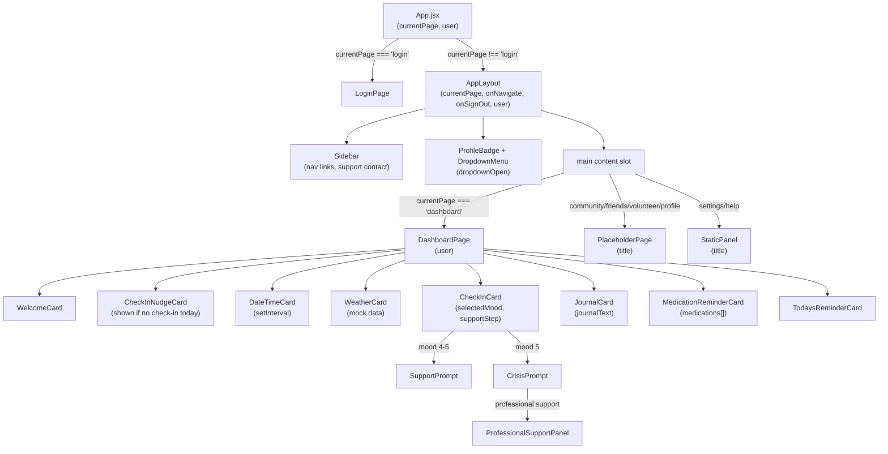

# Design Document — AppLayout and DashboardPage

## 1. Technical Design

### Overview

This feature introduces a persistent authenticated shell (`AppLayout`) and a fully-featured `DashboardPage` for NeighborCircle. The shell wraps every authenticated page and provides left-sidebar navigation, a top-right profile badge with dropdown, and a main content slot. The `DashboardPage` replaces the current placeholder and renders all daily wellness cards inline. All state is local React `useState`; no routing library or backend is used.

The key architectural rule: `LoginPage` is rendered **outside** `AppLayout`. `App.jsx` owns the `currentPage` state and decides which top-level branch to render.

### Architecture Diagram



---

## 2. Component Structure

Four files cover the entire MVP. Dashboard card sub-components live inline inside `DashboardPage.jsx` as local functions — they are not split into separate files because they share `DashboardPage` state directly and are not reused elsewhere.

```
src/
  App.jsx                          ← updated: currentPage, user, routing logic
  components/
    AppLayout.jsx                  ← sidebar, profile badge, dropdown, content slot
  pages/
    DashboardPage.jsx              ← all dashboard cards (inline sub-components)
    PlaceholderPage.jsx            ← reusable "coming soon" page (title prop)
```

### AppLayout.jsx

Props:
- `currentPage` (string) — which authenticated page is active
- `onNavigate(page)` — callback to update `currentPage` in App.jsx
- `onSignOut()` — callback to set `currentPage` to `'login'`
- `user` — `{ firstName, lastName }` object

Internal state:
- `dropdownOpen` (boolean) — controls ProfileBadge dropdown visibility

Renders:
- Left sidebar with nav links (Dashboard, Community Forum, Friends Match, Volunteer Match, Profile) and tech support contact at the bottom
- Top-right ProfileBadge (initials derived from `user.firstName[0] + user.lastName[0]`)
- DropdownMenu (Profile → navigates to 'profile', Settings → navigates to 'settings', Help → navigates to 'help', Sign Out → calls `onSignOut`)
- `<main>` slot that renders the child page based on `currentPage`

Sidebar nav pages map:
```js
const NAV_LINKS = [
  { label: 'Dashboard',       page: 'dashboard' },
  { label: 'Community Forum', page: 'community' },
  { label: 'Friends Match',   page: 'friends'   },
  { label: 'Volunteer Match', page: 'volunteer' },
  { label: 'Profile',         page: 'profile'   },
];
```

### DashboardPage.jsx

Props:
- `user` — `{ firstName, lastName }`

Internal state:
- `selectedMood` (number | null) — 1–5 or null
- `supportStep` ('none' | 'support' | 'crisis' | 'professional' | 'confirmed') — drives CheckInCard sub-flow
- `journalText` (string)
- `medications` (string[])
- `newMedInput` (string)
- `medError` (string) — inline validation message for empty add attempt
- `todayKey` (string) — `new Date().toDateString()` used to determine nudge visibility
- `checkedInToday` (boolean) — true once a mood is submitted for `todayKey`

Inline sub-components (defined inside the file, not exported):
- `WelcomeCard` — greeting + ProfileBadge
- `CheckInNudgeCard` — shown when `!checkedInToday`
- `DateTimeCard` — `now` state + `useEffect` setInterval
- `WeatherCard` — static mock data
- `CheckInCard` — mood buttons, supportive message, SupportPrompt, CrisisPrompt, ProfessionalSupportPanel
- `JournalCard` — controlled textarea
- `MedicationReminderCard` — add/remove list
- `TodaysReminderCard` — static message

### PlaceholderPage.jsx

Props:
- `title` (string)

Renders a centered card with the title and a "coming soon" message. Used for Community Forum, Friends Match, Volunteer Match, and Profile.

### App.jsx (updated)

State:
- `currentPage` (string, default `'login'`)
- `user` (object, default `{ firstName: 'Margaret', lastName: 'Thompson' }`)

Routing logic:
```jsx
if (currentPage === 'login') {
  return <LoginPage onLoginSuccess={() => setCurrentPage('dashboard')} />;
}
return (
  <AppLayout
    currentPage={currentPage}
    onNavigate={setCurrentPage}
    onSignOut={() => setCurrentPage('login')}
    user={user}
  />
);
```

---

## 3. State Design

### App.jsx state

| State var    | Type   | Initial value                              | Purpose                          |
|--------------|--------|--------------------------------------------|----------------------------------|
| `currentPage`| string | `'login'`                                  | Top-level page routing           |
| `user`       | object | `{ firstName: 'Margaret', lastName: 'Thompson' }` | Mock authenticated user |

### AppLayout state

| State var      | Type    | Initial value | Purpose                        |
|----------------|---------|---------------|--------------------------------|
| `dropdownOpen` | boolean | `false`       | Show/hide ProfileBadge dropdown|

### DashboardPage state

| State var       | Type              | Initial value | Purpose                                      |
|-----------------|-------------------|---------------|----------------------------------------------|
| `selectedMood`  | number \| null    | `null`        | Currently selected mood (1–5)                |
| `supportStep`   | string            | `'none'`      | CheckInCard sub-flow stage                   |
| `journalText`   | string            | `''`          | Controlled journal textarea value            |
| `medications`   | string[]          | `[]`          | List of medication reminder names            |
| `newMedInput`   | string            | `''`          | Controlled input for new medication          |
| `medError`      | string            | `''`          | Inline validation message                    |
| `checkedInToday`| boolean           | `false`       | Whether mood submitted for today             |
| `todayKey`      | string            | `new Date().toDateString()` | Date string for nudge logic  |

### DateTimeCard state (inline, inside DashboardPage)

| State var | Type | Initial value  | Purpose                    |
|-----------|------|----------------|----------------------------|
| `now`     | Date | `new Date()`   | Current time, updated 1/sec|

---

## 4. Rendering Logic

### AppLayout content slot

```
currentPage === 'dashboard'  → <DashboardPage user={user} />
currentPage === 'community'  → <PlaceholderPage title="Community Forum" />
currentPage === 'friends'    → <PlaceholderPage title="Friends Match" />
currentPage === 'volunteer'  → <PlaceholderPage title="Volunteer Match" />
currentPage === 'profile'    → <PlaceholderPage title="Profile" />
currentPage === 'settings'   → <StaticPanel title="Settings" />
currentPage === 'help'       → <StaticPanel title="Help" />
```

`StaticPanel` is a tiny inline component inside `AppLayout.jsx` (not a separate file) since it's only two lines of content.

### CheckInCard supportStep flow

```
selectedMood === null
  → show 5 mood buttons

selectedMood set (any)
  → show supportive message
  → supportStep = 'none'

selectedMood === 4 or 5
  → additionally show SupportPrompt (supportStep = 'support')

selectedMood === 5
  → additionally show CrisisPrompt (supportStep = 'crisis')

CrisisPrompt "Professional support" clicked
  → supportStep = 'professional' → show ProfessionalSupportPanel

ProfessionalSupportPanel contact mode clicked
  → supportStep = 'confirmed' → show "A professional will be with you shortly."

SupportPrompt/CrisisPrompt "Maybe Later" clicked
  → supportStep = 'none'

SupportPrompt nav buttons (Community Forum, Friends Match, Volunteer Match)
  → call onNavigate(page) passed down from AppLayout via DashboardPage
```

DashboardPage needs `onNavigate` passed as a prop from AppLayout so CheckInCard can trigger navigation.

Updated DashboardPage props:
- `user` — `{ firstName, lastName }`
- `onNavigate(page)` — passed through to CheckInCard

### CheckInNudgeCard visibility

```js
// shown when checkedInToday === false
// hidden once user selects a mood (setCheckedInToday(true) called on mood select)
```

### DateTimeCard interval

```js
useEffect(() => {
  const id = setInterval(() => setNow(new Date()), 1000);
  return () => clearInterval(id); // cleanup on unmount
}, []);
```

### MedicationReminderCard add logic

```js
function handleAdd() {
  if (!newMedInput.trim()) {
    setMedError('Please enter a medication name.');
    return;
  }
  setMedications(prev => [...prev, newMedInput.trim()]);
  setNewMedInput('');
  setMedError('');
}
```

### ProfileBadge initials

```js
const initials = `${user.firstName[0]}${user.lastName[0]}`.toUpperCase();
```

### Dropdown close on outside click

```jsx
// useEffect attaches a mousedown listener to document
// if click target is outside the dropdown ref, setDropdownOpen(false)
useEffect(() => {
  if (!dropdownOpen) return;
  function handleOutside(e) {
    if (dropdownRef.current && !dropdownRef.current.contains(e.target)) {
      setDropdownOpen(false);
    }
  }
  document.addEventListener('mousedown', handleOutside);
  return () => document.removeEventListener('mousedown', handleOutside);
}, [dropdownOpen]);
```

---

## 5. Correctness Properties

*A property is a characteristic or behavior that should hold true across all valid executions of a system — essentially, a formal statement about what the system should do. Properties serve as the bridge between human-readable specifications and machine-verifiable correctness guarantees.*

### Property 1: ProfileBadge initials are always correct

*For any* user object with a non-empty `firstName` and `lastName`, the ProfileBadge should display exactly the uppercase first character of each name concatenated together.

**Validates: Requirements 1.5**

---

### Property 2: Navigation always updates the active page

*For any* nav link in the sidebar, activating it should result in the corresponding page being rendered in the main content slot, and the sidebar and ProfileBadge should remain visible.

**Validates: Requirements 1.4, 2.3**

---

### Property 3: AppLayout wraps authenticated pages only

*For any* `currentPage` value that is not `'login'`, `App.jsx` should render `AppLayout`; when `currentPage` is `'login'`, `App.jsx` should render `LoginPage` without `AppLayout`.

**Validates: Requirements 13.1, 13.2, 13.3**

---

### Property 4: CheckInNudgeCard visibility matches check-in state

*For any* dashboard render, the `CheckInNudgeCard` should be visible if and only if no mood has been submitted for the current calendar day. Submitting a mood should cause it to disappear.

**Validates: Requirements 4.1, 4.2**

---

### Property 5: Selecting any mood shows a supportive message

*For any* mood option (1–5), selecting it should result in a supportive response message being displayed in the `CheckInCard`.

**Validates: Requirements 7.3**

---

### Property 6: Low mood selections show appropriate prompts

*For any* mood selection of 4 or 5, the `SupportPrompt` should be displayed. For mood 5 specifically, the `CrisisPrompt` should additionally be displayed alongside the `SupportPrompt`.

**Validates: Requirements 7.4, 7.5**

---

### Property 7: Contact mode confirmation message is always shown

*For any* contact mode button (Phone, Video, or Chat) activated in the `ProfessionalSupportPanel`, the message "A professional will be with you shortly." should be displayed.

**Validates: Requirements 7.11**

---

### Property 8: Mood re-selection replaces previous selection

*For any* two different mood selections made on the same calendar day, the second selection should replace the first — only the latest mood and its corresponding supportive message should be shown.

**Validates: Requirements 7.12**

---

### Property 9: WeeklyMoodTracker records latest mood per day

*For any* sequence of mood selections on the same calendar day, the tracker should store only the most recent selection for that day, replacing any prior value.

**Validates: Requirements 8.1, 8.3**

---

### Property 10: FollowUpPrompt threshold

*For any* week where the `WeeklyMoodTracker` records mood 4 or 5 on 3 or more distinct calendar days, the `FollowUpPrompt` should be displayed on the `DashboardPage`.

**Validates: Requirements 8.4**

---

### Property 11: Journal text is a controlled input

*For any* string typed into the `JournalCard` textarea, the component's `journalText` state should exactly reflect the current textarea value after each keystroke.

**Validates: Requirements 9.2**

---

### Property 12: Medication list renders all reminders with Remove buttons

*For any* non-empty `medications` array in state, every reminder name should be rendered in the list and each should have an associated Remove button.

**Validates: Requirements 10.1, 10.5**

---

### Property 13: Adding a valid medication appends it and clears input

*For any* non-empty, non-whitespace medication name entered in the input field, activating Add should append it to the `medications` list and clear the input field.

**Validates: Requirements 10.3**

---

### Property 14: Removing a medication removes it from the list

*For any* medication currently in the `medications` list, activating its Remove button should result in that medication no longer appearing in the rendered list.

**Validates: Requirements 10.6**

---

### Property 15: DateTimeCard clock updates every second

*For any* mounted `DateTimeCard`, advancing time by 1 second should result in the displayed time updating to reflect the new current time.

**Validates: Requirements 5.2**

---

## 6. Error Handling

| Scenario | Handling |
|---|---|
| User activates Add with empty medication input | `medError` state set to a friendly message; no item added to list |
| User activates Add with whitespace-only input | Treated as empty; same validation message shown |
| `user` prop missing firstName or lastName | Initials derivation should guard with `?.` or default to `'?'` to avoid crash |
| `setInterval` in DateTimeCard | Cleaned up via `useEffect` return to prevent memory leaks on unmount |
| Dropdown open, user navigates away | `dropdownOpen` resets to `false` on re-render since it's local state |

---

## 7. Testing Strategy

### Unit Tests

Focus on specific examples, edge cases, and error conditions:

- `AppLayout` renders sidebar, ProfileBadge, and main content slot
- `AppLayout` sidebar contains all five nav links in correct order
- `AppLayout` sidebar shows tech support contact info
- `AppLayout` ProfileBadge click opens dropdown with correct options
- `AppLayout` Sign Out calls `onSignOut` callback
- `AppLayout` Settings/Help options render correct StaticPanel
- `AppLayout` outside click closes dropdown
- `DashboardPage` renders all expected cards
- `CheckInNudgeCard` hidden after mood is submitted
- `WeatherCard` shows placeholder label
- `MedicationReminderCard` shows validation message on empty add
- `MedicationReminderCard` input and Add button have accessible labels
- `JournalCard` textarea has accessible label
- `DateTimeCard` clears interval on unmount
- `TodaysReminderCard` shows "Today's Reminder" heading
- `FollowUpPrompt` dismissed state persists for the day
- `App.jsx` renders `LoginPage` when `currentPage === 'login'`

### Property-Based Tests

Use a property-based testing library (e.g., **fast-check** for JavaScript/React) with a minimum of **100 iterations per property**.

Each test must be tagged with a comment in this format:
`// Feature: app-layout-dashboard, Property {N}: {property_text}`

| Property | Test description |
|---|---|
| P1: ProfileBadge initials | Generate random `{ firstName, lastName }` strings; assert badge shows correct uppercase initials |
| P2: Navigation updates page | For each nav link, simulate click and assert correct page renders with sidebar still present |
| P3: AppLayout wraps authenticated pages only | Generate random authenticated page strings; assert AppLayout renders; assert 'login' renders LoginPage |
| P4: CheckInNudgeCard visibility | Generate mood submission / no-submission states; assert nudge visibility matches `!checkedInToday` |
| P5: Mood shows supportive message | For each of 5 mood values, simulate selection and assert a non-empty supportive message appears |
| P6: Low mood shows prompts | For moods 4 and 5, assert SupportPrompt present; for mood 5, assert CrisisPrompt also present |
| P7: Contact mode confirmation | For each of Phone/Video/Chat, simulate click and assert confirmation message appears |
| P8: Mood re-selection replaces previous | Select mood A then mood B; assert only mood B's message is shown |
| P9: WeeklyMoodTracker latest per day | Submit multiple moods for same day; assert tracker stores only the last |
| P10: FollowUpPrompt threshold | Generate weeks with varying low-mood day counts; assert prompt appears iff count >= 3 |
| P11: Journal controlled input | Generate random strings; type into textarea; assert state matches input value |
| P12: Medication list renders all with Remove | Generate random medication arrays; assert all names rendered each with a Remove button |
| P13: Adding valid medication appends and clears | Generate random non-empty strings; add each; assert list grows and input clears |
| P14: Removing medication removes from list | Generate list with random items; remove one; assert it's gone from rendered list |
| P15: DateTimeCard clock updates | Mock timers; advance 1 second; assert displayed time updates |

---

## 8. Reduced MVP Implementation Plan

### Files to create / modify

| File | Action |
|---|---|
| `src/App.jsx` | Modify — add `user` state, AppLayout branch, onSignOut |
| `src/components/AppLayout.jsx` | Create |
| `src/pages/DashboardPage.jsx` | Replace placeholder with full implementation |
| `src/pages/PlaceholderPage.jsx` | Create |

### Task Breakdown

**Task 1 — Update App.jsx**
- Add `user` mock state `{ firstName: 'Margaret', lastName: 'Thompson' }`
- Add authenticated branch: render `<AppLayout>` when `currentPage !== 'login'`
- Pass `currentPage`, `onNavigate`, `onSignOut`, `user` props to AppLayout
- Keep `LoginPage` branch unchanged

**Task 2 — Build AppLayout.jsx**
- Render two-column layout: fixed left sidebar + flex-1 main area
- Sidebar: NeighborCircle brand name, nav links (NAV_LINKS map), tech support contact at bottom
- Top-right ProfileBadge: amber circle with initials, min 48×48px, keyboard focusable
- DropdownMenu: Profile / Settings / Help / Sign Out, closes on outside click
- Content slot: switch on `currentPage` to render DashboardPage, PlaceholderPage, or StaticPanel
- StaticPanel as inline component inside this file
- Amber/orange Tailwind palette throughout, focus:ring on all interactive elements

**Task 3 — Build PlaceholderPage.jsx**
- Accept `title` prop
- Render centered card with title heading and "coming soon" message
- Amber palette, large text

**Task 4 — Build DashboardPage.jsx**
- Accept `user` and `onNavigate` props
- Declare all state vars (selectedMood, supportStep, journalText, medications, newMedInput, medError, checkedInToday, todayKey)
- Implement WelcomeCard inline sub-component
- Implement CheckInNudgeCard inline sub-component (conditional render)
- Implement DateTimeCard inline sub-component with useEffect setInterval
- Implement WeatherCard inline sub-component (mock data)
- Implement CheckInCard inline sub-component with full supportStep flow
- Implement JournalCard inline sub-component (controlled textarea)
- Implement MedicationReminderCard inline sub-component (add/remove list)
- Implement TodaysReminderCard inline sub-component
- Render all cards in a responsive grid/stack layout

---

## 9. Phase 2 Features to Defer

These are explicitly out of scope for this MVP implementation:

| Feature | Reason deferred |
|---|---|
| `WeeklyMoodTracker` + `FollowUpPrompt` | Requires multi-day state persistence; adds complexity beyond MVP |
| Real weather API integration | Requires API key management and async data fetching |
| Activity Notifications | Requires backend event system |
| Real authentication / backend | Out of scope for local-state MVP |
| React Router | Deferred until multi-page complexity justifies it |
| `WeeklyMoodTracker` data visualisation | No UI display in MVP per requirements |
