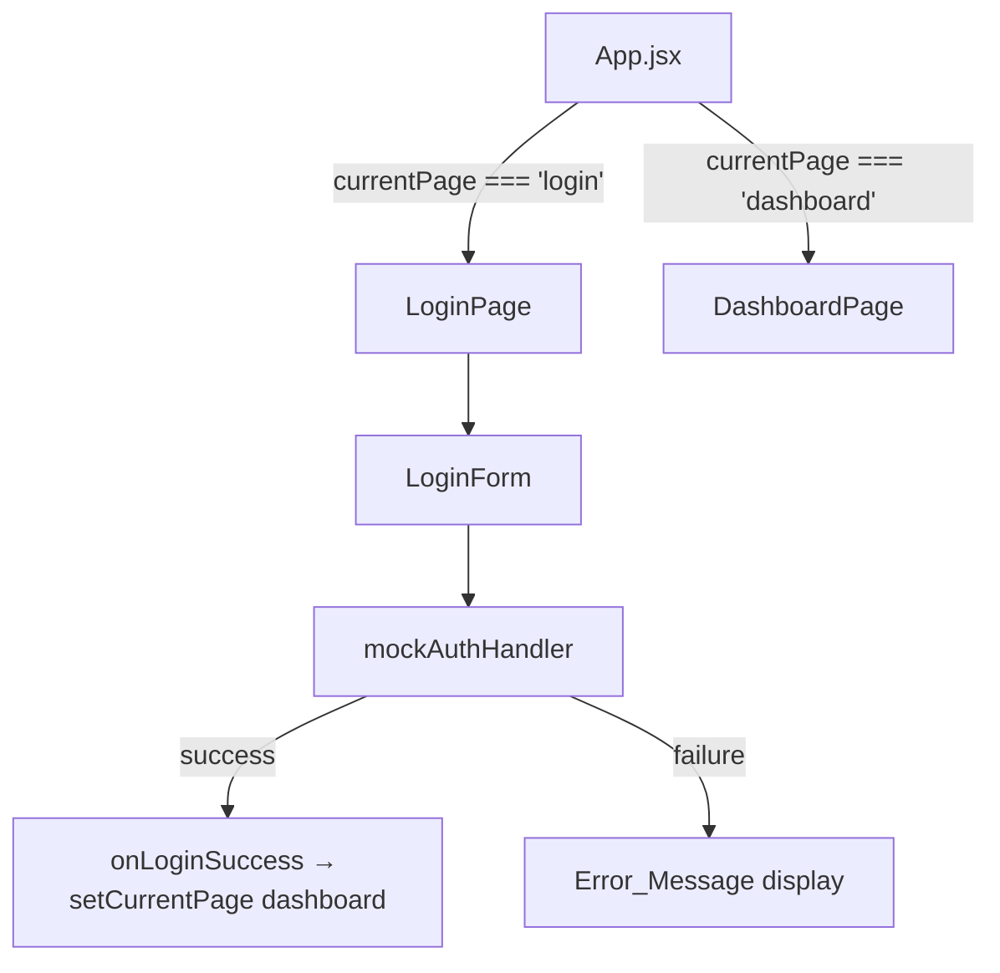

# Design Document — Login

## Overview

The Login page is the entry point to NeighborCircle. It must feel warm, safe, and simple — especially for seniors with low technical confidence. The design prioritizes large touch targets, plain language, clear feedback, and a forgiving form experience.

**MVP Navigation Note:** This design uses a temporary, intentionally simple navigation approach. App.jsx manages a `currentPage` state variable and conditionally renders either `LoginPage` or `DashboardPage`. There is no React Router or URL-based routing — this is a deliberate MVP shortcut to keep the implementation minimal. When the project is ready for real routing, `currentPage` state in App.jsx is replaced with React Router, and the `onLoginSuccess` callback becomes a `navigate()` call. No other files need to change.

Authentication uses a mock handler that validates against a hardcoded credential set. The handler's function signature is designed to be swapped for a real API call (Node.js/Firebase) without touching the form component.

---

## Architecture



App.jsx owns `currentPage` and passes an `onLoginSuccess` callback to LoginPage. LoginPage passes it down to LoginForm. On success, LoginForm calls `onLoginSuccess`, which triggers `setCurrentPage('dashboard')` in App.jsx.

> **MVP note:** The `onLoginSuccess` callback is the seam where React Router's `navigate('/dashboard')` will slot in when routing is introduced. The rest of the component tree stays unchanged.

---

## Component Structure

The Login feature uses only two components. The help section and guest path are rendered inline inside `LoginPage` — no separate `HelpMessage` component is needed.

### 1. `App.jsx` (modified)

Owns `currentPage` state. Conditionally renders LoginPage or DashboardPage.

```
App
├── currentPage: 'login' | 'dashboard'   ← MVP-only, replace with React Router later
├── → LoginPage  (when currentPage === 'login')
└── → DashboardPage (when currentPage === 'dashboard')
```

### 2. `LoginPage` (`src/pages/LoginPage.jsx`)

Page-level component. Renders branding, welcoming heading, `LoginForm`, help toggle, and guest path — all in one file. Receives `onLoginSuccess` prop from App and passes it to LoginForm.

### 3. `LoginForm` (`src/components/LoginForm.jsx`)

Handles all form state and delegates auth to `mockAuthHandler`. Calls `onLoginSuccess` on successful auth. This is the only sub-component extracted from LoginPage — justified because it owns distinct form state.

### 4. `mockAuthHandler` (`src/auth/mockAuthHandler.js`)

Pure function. Accepts `{ email, password }`, returns `{ success: boolean, error?: string }`. Simulates async delay. No React dependency.

### 5. `DashboardPage` (`src/pages/DashboardPage.jsx`)

Minimal placeholder. Displays a warm welcome message. Exists only to give the MVP a destination after login.

---

## State Design

### App.jsx

```js
// MVP-only: temporary page switcher. Replace with React Router when routing is introduced.
const [currentPage, setCurrentPage] = useState('login');
```

### LoginPage.jsx

```js
const [showHelp, setShowHelp] = useState(false);
```

Help toggle and guest path are rendered inline in LoginPage — no separate component needed.

### LoginForm.jsx

```js
const [email, setEmail]               = useState('');
const [password, setPassword]         = useState('');
const [showPassword, setShowPassword] = useState(false);
const [isLoading, setIsLoading]       = useState(false);
const [emailError, setEmailError]     = useState('');
const [passwordError, setPasswordError] = useState('');
const [generalError, setGeneralError] = useState('');
const [successMessage, setSuccessMessage] = useState('');
```

No state is shared via Context or Redux. All state is local to the component that owns it.

---

## Validation Behavior

Validation runs on form submit, before calling the auth handler.

| Condition | Error target | Message |
|---|---|---|
| Email field is empty | `emailError` | "Please enter your email address." |
| Password field is empty | `passwordError` | "Please enter your password." |
| Credentials not recognized | `generalError` | "We couldn't find that email and password. Please try again." |

Rules:
- Both fields are checked before any auth call is made.
- If either field is empty, focus is moved to the first field with an error (`emailRef` or `passwordRef`).
- Errors are cleared when the user starts typing in the relevant field (`onChange`).
- No time limit or auto-dismiss on error messages.

---

## Rendering Logic

### Submit flow

```
handleSubmit()
  → clear all errors
  → validate email (empty check)
  → validate password (empty check)
  → if any errors: set errors, move focus to first error field, return
  → setIsLoading(true), disable Sign In button
  → await mockAuthHandler({ email, password })
  → setIsLoading(false)
  → if success: setSuccessMessage("You're in! Welcome back.")
                setTimeout(onLoginSuccess, 1500)
  → if failure: setGeneralError("We couldn't find that email and password. Please try again.")
```

### Show/hide password

The password input's `type` attribute is bound to `showPassword ? 'text' : 'password'`. The toggle button uses `aria-pressed` and `aria-label` to communicate state to screen readers. State persists until the user explicitly toggles it again.

### Help section

A "Need help signing in?" button in LoginPage toggles `showHelp`. When `showHelp` is true, a friendly message with contact info is rendered below the form. The button has `aria-expanded={showHelp}`.

### Guest path

A "Continue without signing in" button is rendered below the help link. For MVP it calls `onLoginSuccess` directly, bypassing auth.

---

## File Structure

```
neighborcircle/src/
├── auth/
│   └── mockAuthHandler.js       ← pure auth function, no React
├── components/
│   └── LoginForm.jsx             ← form UI + local state
├── pages/
│   ├── LoginPage.jsx             ← page shell, branding, help
│   ├── DashboardPage.jsx         ← placeholder post-login page
│   └── VolunteerPage.jsx         ← existing, unchanged
└── App.jsx                       ← modified: conditional page rendering
```

---

## Data Models

### Auth handler input/output

```js
// Input
{ email: string, password: string }

// Output
{ success: true }
// or
{ success: false, error: string }
```

### Mock credentials (in mockAuthHandler.js)

```js
const MOCK_USERS = [
  { email: 'user@example.com', password: 'password123' },
];
```

### Auth state (in App.jsx, passed as needed)

For MVP, auth state is just the `currentPage` value. No user object is stored yet — that's a future concern when a real backend is connected.

---

## Correctness Properties

*A property is a characteristic or behavior that should hold true across all valid executions of a system — essentially, a formal statement about what the system should do. Properties serve as the bridge between human-readable specifications and machine-verifiable correctness guarantees.*

### Property 1: Show/hide password toggle changes input type

*For any* LoginForm state, toggling the "Show password" control should change the password input's `type` attribute between `"password"` and `"text"`, and the state should persist until the user explicitly toggles it again.

**Validates: Requirements 2.4, Edge Case 5**

---

### Property 2: Loading state disables the Sign In button

*For any* LoginForm where `isLoading` is `true`, the "Sign In" button should have the `disabled` attribute set and a loading indicator should be present in the rendered output.

**Validates: Requirements 3.3**

---

### Property 3: Auth handler returns a well-formed result object

*For any* email and password string inputs, `mockAuthHandler` should return an object with a boolean `success` field, and when `success` is `false`, the object should also contain a non-empty `error` string.

**Validates: Requirements 3.5**

---

### Property 4: Empty required fields produce field-specific error messages

*For any* form submission where the email field is empty, the `emailError` state should be set to "Please enter your email address." and for any submission where the password field is empty, `passwordError` should be set to "Please enter your password." — and in both cases the auth handler should not be called.

**Validates: Requirements Edge Cases 1, 2**

---

### Property 5: Invalid credentials produce the general error message

*For any* email/password pair that does not match a known mock account, calling `mockAuthHandler` should return `{ success: false }` and the form should display "We couldn't find that email and password. Please try again."

**Validates: Requirements Edge Case 3**

---

### Property 6: Help message visibility is toggled by the help button

*For any* LoginPage state, activating the "Need help signing in?" button should cause the help message to become visible, and activating it again should hide it.

**Validates: Requirements 4.2**

---

## Error Handling

| Scenario | Handling |
|---|---|
| Empty email on submit | Inline error below email field, focus moved to email input |
| Empty password on submit | Inline error below password field, focus moved to password input |
| Both fields empty | Both errors shown, focus moved to email input |
| Invalid credentials | General error at top of form, no field-level errors |
| Auth handler throws unexpectedly | Catch block sets generalError to a friendly fallback message |

Error messages are styled in warm red (`text-red-600`) with sufficient contrast, minimum 16px font size, and accompanied by an icon or prefix text so color is not the only indicator.

---

## Testing Strategy

### Unit tests (Vitest + React Testing Library)

Focus on specific examples, edge cases, and integration points:

- LoginPage renders brand name and welcoming heading
- LoginForm renders email input, password input, and Sign In button with correct labels
- Submitting with valid credentials renders the success message
- Submitting with invalid credentials renders the general error message
- Help button renders the help message when clicked
- Guest path button calls onLoginSuccess without auth
- DashboardPage renders after successful login (App-level integration)

### Property-based tests (fast-check)

Each property test runs a minimum of 100 iterations. Each test is tagged with a comment referencing the design property it validates.

Tag format: `// Feature: login, Property {N}: {property_text}`

- **Property 1** — For any boolean toggle state, the password input type reflects `showPassword` correctly
- **Property 2** — For any `isLoading: true` state, the Sign In button is disabled
- **Property 3** — For any string inputs, `mockAuthHandler` always returns `{ success: boolean, error?: string }`
- **Property 4** — For any submission with empty email or password, the auth handler is never called and the correct error is set
- **Property 5** — For any non-matching credential pair, the form displays the "couldn't find" error message
- **Property 6** — For any toggle sequence on the help button, the help message visibility matches the toggle state

Both test types are complementary. Unit tests catch concrete bugs in specific scenarios; property tests verify the general correctness rules hold across all inputs.
