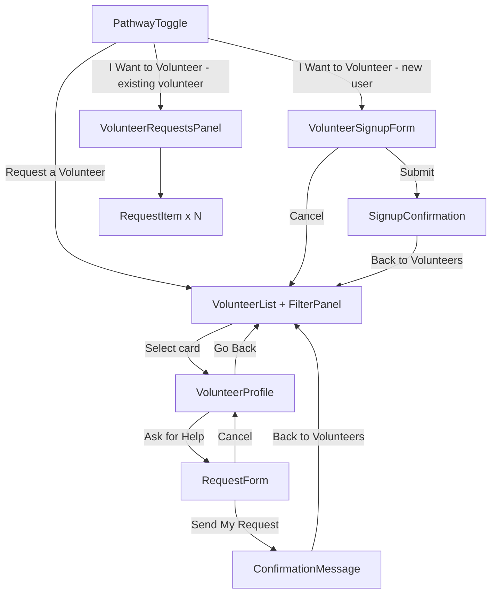
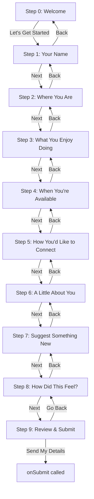

# Design Document: Volunteer Matching & Support System

## Overview

The Volunteer Matching feature is a single-page experience within NeighborCircle that lets seniors browse volunteers, view profiles, and submit support requests — and lets volunteers see and accept incoming requests. There is no backend yet; all data is static/mock, managed entirely in React state.

The design is intentionally minimal. Every screen has one primary action. Navigation is handled through conditional rendering (no router). State is local to the top-level page component and passed down as props.

The emotional design layer — warm headings, Emotional_Anchor phrases, reassuring confirmations — is treated as a first-class concern, not an afterthought.

---

## Architecture

`pages/VolunteerPage.jsx` is a single page with a fixed two-button toggle at the top and a single content area below it. The toggle controls what appears in the content area. There is no routing and no separate full-page views.

```
VolunteerPage
  ├── PathwayToggle (always visible at top)
  │     ├── "Request a Volunteer"   → content area shows VolunteerList
  │     └── "I Want to Volunteer"   → content area shows VolunteerSignupForm
  │
  └── Content Area (one component at a time)
        ├── activePathway = "support", contentView = "browse"        → VolunteerList + FilterPanel
        ├── activePathway = "support", contentView = "profile"       → VolunteerProfile
        ├── activePathway = "support", contentView = "request"       → RequestForm
        ├── activePathway = "support", contentView = "confirmation"  → ConfirmationMessage
        ├── activePathway = "volunteer", contentView = "signup"      → VolunteerSignupForm
        ├── activePathway = "volunteer", contentView = "signup-confirmation" → SignupConfirmation
        └── activePathway = "volunteer", contentView = "requests"    → VolunteerRequestsPanel (existing volunteers only)
```

- "Request a Volunteer" is always the default active tab on page load
- The content area swaps in place — the toggle stays fixed, only the content below it changes
- No React Router. No separate routes. One page, one content area, conditional rendering.



---

## Components and Interfaces

### `pages/VolunteerPage.jsx`

The root component. Owns all shared state. Always renders `PathwayToggle` at the top and one content component below it.

**State:**
- `activePathway: string` — `"support" | "volunteer"` — which tab is active; defaults to `"support"` on page load
- `contentView: string` — `"browse" | "profile" | "request" | "confirmation" | "signup" | "signup-confirmation" | "requests"` — what appears in the content area
- `selectedVolunteer: Volunteer | null`
- `activeFilter: string | null`
- `volunteers: Volunteer[]` — seeded from mock data; new entries appended on signup
- `requests: SupportRequest[]`
- `currentUser: User` — mock user object (senior or volunteer role)

**Rendering logic:**
```jsx
// PathwayToggle always rendered at top
<PathwayToggle activePathway={activePathway} onPathwayChange={handlePathwayChange} />

// Content area — one component at a time
if (contentView === "browse")               return <VolunteerList ... />;
if (contentView === "profile")              return <VolunteerProfile ... />;
if (contentView === "request")              return <RequestForm ... />;
if (contentView === "confirmation")         return <ConfirmationMessage ... />;
if (contentView === "signup")               return <VolunteerSignupForm ... />;
if (contentView === "signup-confirmation")  return <SignupConfirmation ... />;
if (contentView === "requests")             return <VolunteerRequestsPanel ... />;
```

**Initial state:** `activePathway = "support"`, `contentView = "browse"`

---

### `components/PathwayToggle.jsx`

Fixed two-button toggle always visible at the top of the page. Controls which pathway is active and what loads in the content area.

**Props:**
```js
{
  activePathway: "support" | "volunteer",
  onPathwayChange: (pathway: "support" | "volunteer") => void
}
```

**Behavior:**
- Renders exactly two large buttons: "Request a Volunteer" and "I Want to Volunteer"
- "Request a Volunteer" is visually active by default on page load
- The active button has a filled warm background and `aria-pressed="true"`
- Clicking "Request a Volunteer" → `activePathway = "support"`, `contentView = "browse"`, `activeFilter = null`
- Clicking "I Want to Volunteer" is role-aware:
  - `currentUser.role === "volunteer"` → `activePathway = "volunteer"`, `contentView = "requests"`
  - `currentUser.role === "senior"` or unauthenticated → `activePathway = "volunteer"`, `contentView = "signup"`
- `activeFilter` is cleared on any pathway switch
- Buttons meet 44×44px minimum touch target; plain, friendly labels
- Keyboard accessible: Tab to focus, Enter/Space to activate

---

### `components/VolunteerList.jsx`

Displays the browse view: emotional heading, anchor phrase, filter panel, and up to 6 volunteer cards.

**Props:**
```js
{
  volunteers: Volunteer[],       // full list from mock data
  activeFilter: string | null,
  onFilterChange: (filter: string | null) => void,
  onSelectVolunteer: (volunteer: Volunteer) => void,
  requests: SupportRequest[]     // to derive requestStatus per card
}
```

**Behavior:**
- Filters `volunteers` by `activeFilter` before rendering
- Caps display at 6 cards
- Shows empty-state message when filter yields no results
- Shows no-volunteers message when list is empty on load

---

### `components/FilterPanel.jsx`

Row of filter buttons, one active at a time.

**Props:**
```js
{
  supportTypes: string[],        // max 4 options
  activeFilter: string | null,
  onFilterChange: (filter: string | null) => void
}
```

**Behavior:**
- Renders one button per support type plus a "Show All" reset button
- Only one filter active at a time (selecting active filter clears it)
- Buttons meet 44×44px minimum touch target

---

### `components/VolunteerCard.jsx`

Single card in the browse list.

**Props:**
```js
{
  volunteer: Volunteer,
  requestStatus: "not_requested" | "requested" | "accepted",
  onSelect: (volunteer: Volunteer) => void
}
```

**Behavior:**
- Shows: profile photo, name, city/location, availability status, support types (interests)
- "Not Available Right Now" text label when `availabilityStatus` is false
- Entire card is keyboard-focusable and activatable via Enter
- Warm color scheme; minimum 18px font; large touch target

---

### `components/VolunteerProfile.jsx`

Detailed view of a single volunteer.

**Props:**
```js
{
  volunteer: Volunteer,
  requestStatus: "not_requested" | "requested" | "accepted",
  onAskForHelp: () => void,
  onGoBack: () => void
}
```

**Behavior:**
- Shows full name, photo, bio, support types, availability, personal note
- Reassuring phrase near photo
- Single primary action: "Ask for Help" button (disabled + shows "Request Sent" if `requestStatus` is `requested` or `accepted`)
- "Go Back" returns to browse without losing filter

---

### `components/RequestForm.jsx`

The support request submission form.

**Props:**
```js
{
  volunteer: Volunteer,
  onSubmit: (message: string) => void,
  onCancel: () => void
}
```

**State (local):**
- `message: string` — the senior's typed text
- `error: string | null` — inline validation message
- `submitting: boolean`

**Behavior:**
- Single textarea with warm placeholder text
- "Send My Request" primary button
- "Cancel" secondary button — no confirmation dialog
- Empty submit shows gentle inline error, does not clear message
- On success, calls `onSubmit(message)` — parent handles state update and view switch

---

### `components/ConfirmationMessage.jsx`

Shown after a successful request submission.

**Props:**
```js
{
  volunteerName: string,
  seniorName: string,
  onDone: () => void   // returns to browse
}
```

**Behavior:**
- Displays warm confirmation copy with volunteer name and senior name interpolated
- Emotional_Anchor phrase included
- Stays visible for at least 5 seconds (enforced via `useEffect` + `setTimeout` before enabling the done button)
- Single "Back to Volunteers" button after the delay

---

### `components/VolunteerRequestsPanel.jsx`

Volunteer-facing view of incoming requests.

**Props:**
```js
{
  requests: SupportRequest[],
  onAccept: (requestId: string) => void
}
```

**Behavior:**
- Lists pending requests for the current volunteer
- Empty state shows warm encouraging message
- Each request shows senior name, date, message preview

---

### `components/RequestItem.jsx`

Single request row in the volunteer panel.

**Props:**
```js
{
  request: SupportRequest,
  onAccept: (requestId: string) => void
}
```

**Behavior:**
- Shows full request details on expand/select
- Single "I'll Help" primary action
- On accept: calls `onAccept`, parent updates request status

---

### `components/VolunteerSignupForm.jsx`

The orchestrator component for the "Become a Neighbor Helper" multi-step guided flow. It owns all step state and renders one step sub-component at a time. There are 10 steps (0–9), each covering a single topic to minimise cognitive load.

**Props:**
```js
{
  onSubmit: (volunteerData: NewVolunteerData) => void,
  onCancel: () => void
}
```

**State (local):**
```js
{
  currentStep: number,           // 0–9
  name: string,
  photo: File | null,            // optional profile picture
  city: string,
  activities: string[],          // selected from ACTIVITY_OPTIONS
  customActivity: string,        // revealed when "Something else" is selected in activities
  availability: {
    days: string,                // "Weekdays" | "Weekends" | "Both" | "Flexible"
    times: string,               // "Mornings" | "Afternoons" | "Evenings" | "Flexible"
    frequency: string            // "Once a week" | "A few times a month" | "Occasionally" | "Whatever's needed"
  },
  communication: string[],       // selected from COMMUNICATION_OPTIONS
  personalNote: string,
  suggestedActivity: string,
  feedbackRating: "easy" | "hard" | null,
  feedbackReasons: string[],     // revealed only when feedbackRating === "hard"
  customFeedbackReason: string,  // revealed when "Something else" selected in feedback reasons
  anythingElse: string,          // open text, shown after feedback reasons
  errors: { name?: string, city?: string, activities?: string }
}
```

**Step sub-components** (each receives only the slice of state it needs plus `onNext` / `onBack` callbacks):

| Step | Component | Topic |
|---|---|---|
| 0 | `SignupStepWelcome` | Warm greeting, no fields, single "Let's Get Started" button |
| 1 | `SignupStepName` | "What would you like us to call you?" — text input + optional photo upload |
| 2 | `SignupStepCity` | "What town or city are you in?" — single text input |
| 3 | `SignupStepActivities` | "What kinds of things do you enjoy helping with?" — checkbox group |
| 4 | `SignupStepAvailability` | Days / Times of day / Frequency — three structured choice groups |
| 5 | `SignupStepCommunication` | "How do you prefer to stay in touch?" — checkbox group |
| 6 | `SignupStepPersonalNote` | "Is there anything you'd like your neighbors to know about you?" — optional textarea |
| 7 | `SignupStepSuggestActivity` | "Is there something you'd love to offer that isn't on our list?" — optional text input |
| 8 | `SignupStepFeedback` | "Was this form easy or hard to fill in?" — two large buttons + conditional reasons |
| 9 | `SignupStepReview` | Plain-language summary of all answers + "Send My Details" button |

**Behavior:**
- Renders exactly one step sub-component at a time based on `currentStep`
- "Next" / "Back" buttons on each step; step 0 shows only "Let's Get Started"; step 9 shows "Send My Details" and a "Go Back" link
- No step counter or progress bar — removes visual pressure for seniors
- Validation fires only on "Next" / "Send My Details" — never on blur or keystroke
- Required fields: `name` (step 1), `city` (step 2), at least one `activities` selection (step 3)
- All other fields are optional
- Validation messages are gentle: e.g. "Just let us know your name — anything you're comfortable with"
- On validation failure: inline message shown below the relevant field; no input cleared; step does not advance
- "Back" never loses data — all state is preserved in `VolunteerSignupForm`
- All structured choices use large touch targets (minimum 44×44px)
- Warm placeholder text on every text input
- Photo upload is clearly optional with copy: "You can always add one later — no pressure"
- On valid final submit: calls `onSubmit(volunteerData)` — parent handles adding to volunteers array and switching view
- "Cancel" (available on step 0 only via a small secondary link) returns to browse without confirmation dialog

---

### `components/SignupConfirmation.jsx`

Shown after a successful volunteer signup.

**Props:**
```js
{
  firstName: string,
  onDone: () => void   // returns to browse
}
```

**Behavior:**
- Heading: "You're officially a Neighbor Helper, [firstName]!"
- Body: "Thank you for signing up. We'll match you with neighbors who could use your kindness soon."
- Emotional_Anchor phrase: "Every connection starts with someone willing to show up — and that's you."
- Single "Back to Volunteers" button as the only action
- No timer or delay — the volunteer can proceed whenever they're ready

---

## Data Models

All data lives in `data/mockData.js` as static arrays. No API calls.

### `Volunteer`

```js
{
  id: string,                        // e.g. "v-001"
  name: string,                      // full name
  firstName: string,
  photo: string,                     // image URL or path
  bio: string,                       // short bio (2–3 sentences)
  personalNote: string,              // warm note shown on profile
  supportTypes: string[],            // e.g. ["Friendly Chat", "Grocery Help"]
  availabilityStatus: boolean        // true = available
}
```

### `SupportRequest`

```js
{
  id: string,                        // e.g. "req-001"
  volunteerId: string,
  seniorName: string,
  seniorId: string,
  message: string,
  submittedAt: string,               // ISO date string
  status: "not_requested" | "requested" | "accepted"
}
```

### `User` (mock current user)

```js
{
  id: string,
  firstName: string,
  role: "senior" | "volunteer"       // controls which view is shown
}
```

### Support Types (enum-like constant)

```js
// data/supportTypes.js
export const SUPPORT_TYPES = [
  "Friendly Chat",
  "Grocery Help",
  "Tech Help",
  "Errands"
];
```

### Activity Options (enum-like constant)

```js
// data/activityOptions.js
export const ACTIVITY_OPTIONS = [
  "Friendly phone calls",
  "In-person visits",
  "Tech help (phones, tablets, computers)",
  "Grocery help",
  "Errands",
  "Appointment support",
  "Reading together",
  "Walking together",
  "Community events",
  "Something else"
];
```

### Availability Options (enum-like constants)

```js
// data/availabilityOptions.js
export const AVAILABILITY_DAYS    = ["Weekdays", "Weekends", "Both", "Flexible"];
export const AVAILABILITY_TIMES   = ["Mornings", "Afternoons", "Evenings", "Flexible"];
export const AVAILABILITY_FREQ    = ["Once a week", "A few times a month", "Occasionally", "Whatever's needed"];
```

### Communication Options (enum-like constant)

```js
// data/communicationOptions.js
export const COMMUNICATION_OPTIONS = [
  "Phone call",
  "Video call",
  "Text message",
  "In person",
  "Open to anything"
];
```

### Feedback Reason Options (enum-like constant)

```js
// data/feedbackReasonOptions.js
export const FEEDBACK_REASON_OPTIONS = [
  "Too many questions",
  "The questions were confusing",
  "I wasn't sure what to write",
  "I needed more time",
  "Something else"
];
```

### `NewVolunteerData`

The shape of data produced by `VolunteerSignupForm` on submit, before it is merged into a full `Volunteer` object:

```js
{
  fullName: string,              // required — derived from name field
  city: string,                  // required
  activities: string[],          // required, at least one value from ACTIVITY_OPTIONS
  customActivity: string,        // optional — populated when "Something else" selected
  availability: {
    days: string,                // one of AVAILABILITY_DAYS
    times: string,               // one of AVAILABILITY_TIMES
    frequency: string            // one of AVAILABILITY_FREQ
  },
  communication: string[],       // selected from COMMUNICATION_OPTIONS
  personalNote: string,          // optional
  suggestedActivity: string,     // optional
  feedbackRating: "easy" | "hard" | null,
  feedbackReasons: string[],     // populated when feedbackRating === "hard"
  customFeedbackReason: string,  // populated when "Something else" selected in feedback
  anythingElse: string,          // optional open text after feedback reasons
  photo: File | null             // optional profile picture
}
```

When `VolunteerPage.handleSignupSubmit` receives this, it constructs a full `Volunteer` object by generating a new `id`, deriving `firstName` from `fullName`, setting `availabilityStatus: true`, and mapping `activities` to `supportTypes`.

---

## State Management

All meaningful state lives in `VolunteerPage`. Child components receive data and callbacks as props — no prop drilling beyond two levels.

```
VolunteerPage state
├── activePathway        "support" | "volunteer" — which tab is active (default: "support")
├── contentView          what renders in the content area (default: "browse")
├── selectedVolunteer    the volunteer being viewed/requested
├── activeFilter         current filter selection (null = show all)
├── volunteers           array of Volunteer objects (seeded from mock data; grows on signup)
├── requests             array of SupportRequest objects
└── currentUser          mock user (role determines volunteer pathway destination)
```

`VolunteerSignupForm` owns its own local state (all step data listed below). This state is never hoisted to `VolunteerPage` until the final submit.

```
VolunteerSignupForm local state
├── currentStep          0–9 — which step sub-component is rendered
├── name                 string
├── photo                File | null
├── city                 string
├── activities           string[]
├── customActivity       string
├── availability         { days, times, frequency }
├── communication        string[]
├── personalNote         string
├── suggestedActivity    string
├── feedbackRating       "easy" | "hard" | null
├── feedbackReasons      string[]
├── customFeedbackReason string
├── anythingElse         string
└── errors               { name?, city?, activities? }
```

**State transitions — VolunteerPage:**

| Action | State change |
|---|---|
| Page loads | `activePathway = "support"`, `contentView = "browse"` |
| Click "Request a Volunteer" tab | `activePathway = "support"`, `contentView = "browse"`, `activeFilter = null` |
| Click "I Want to Volunteer" (existing volunteer) | `activePathway = "volunteer"`, `contentView = "requests"`, `activeFilter = null` |
| Click "I Want to Volunteer" (non-volunteer / unauthenticated) | `activePathway = "volunteer"`, `contentView = "signup"`, `activeFilter = null` |
| Click a VolunteerCard | `selectedVolunteer = volunteer`, `contentView = "profile"` |
| Click "Ask for Help" | `contentView = "request"` |
| Submit request (success) | push new SupportRequest to `requests`, `contentView = "confirmation"` |
| Click "Go Back" from profile | `contentView = "browse"` (filter preserved) |
| Click "Cancel" from request form | `contentView = "profile"` |
| Volunteer clicks "I'll Help" | update matching request `status` to `"accepted"` |
| Filter button clicked | `activeFilter = supportType` or `null` if toggled off |
| Submit signup (valid) | push new Volunteer to `volunteers`, `contentView = "signup-confirmation"` |
| Click "Cancel" from signup form | `contentView = "browse"`, `activePathway = "support"` |
| Click "Back to Volunteers" from signup confirmation | `contentView = "browse"`, `activePathway = "support"` |

**State transitions — VolunteerSignupForm (step navigation):**

| Action | State change |
|---|---|
| Click "Let's Get Started" (step 0) | `currentStep = 1` |
| Click "Next" on step 1 — name valid | `currentStep = 2` |
| Click "Next" on step 1 — name empty/whitespace | `errors.name = gentle message`, `currentStep` unchanged |
| Click "Next" on step 2 — city valid | `currentStep = 3` |
| Click "Next" on step 2 — city empty/whitespace | `errors.city = gentle message`, `currentStep` unchanged |
| Click "Next" on step 3 — at least one activity selected | `currentStep = 4` |
| Click "Next" on step 3 — no activities selected | `errors.activities = gentle message`, `currentStep` unchanged |
| Click "Next" on steps 4–8 (all optional) | `currentStep = currentStep + 1` |
| Click "Back" on any step 1–9 | `currentStep = currentStep - 1`, all state preserved |
| Select "It was a bit hard" on step 8 | `feedbackRating = "hard"`, reason checkboxes revealed |
| Select "It was easy" on step 8 | `feedbackRating = "easy"`, reason checkboxes hidden |
| Select "Something else" in activities (step 3) | `customActivity` input revealed |
| Select "Something else" in feedback reasons (step 8) | `customFeedbackReason` input revealed |
| Click "Send My Details" (step 9) | calls `onSubmit(volunteerData)` |

`activeFilter` is never reset when navigating to a profile and back — it stays in `VolunteerPage` state, so the filtered list is exactly as the senior left it.

---

## How Filtering Works

Filtering is a pure derived computation — no extra state needed beyond `activeFilter`.

```js
const displayedVolunteers = volunteers
  .filter(v => activeFilter === null || v.supportTypes.includes(activeFilter))
  .slice(0, 6);
```

- When `activeFilter` is `null`, all volunteers are shown (capped at 6)
- When a filter is active, only matching volunteers are shown (still capped at 6)
- The cap of 6 is applied after filtering, not before
- Empty result → warm empty-state message rendered instead of cards

---

## How Navigation Works

No router. `VolunteerPage` is a single page. `PathwayToggle` is always visible at the top. The content area below it renders one component at a time based on `contentView`:

```jsx
<PathwayToggle activePathway={activePathway} onPathwayChange={handlePathwayChange} />

// Content area
if (contentView === "browse")               return <VolunteerList ... />;
if (contentView === "profile")              return <VolunteerProfile ... />;
if (contentView === "request")              return <RequestForm ... />;
if (contentView === "confirmation")         return <ConfirmationMessage ... />;
if (contentView === "signup")               return <VolunteerSignupForm ... />;
if (contentView === "signup-confirmation")  return <SignupConfirmation ... />;
if (contentView === "requests")             return <VolunteerRequestsPanel ... />;
```

The page always opens with `activePathway = "support"` and `contentView = "browse"` — volunteer cards are the default view. The signup form appears in the same content area when "I Want to Volunteer" is clicked; it does not navigate to a new page.

## How Request State Flows

1. Senior submits form → `VolunteerPage.handleSubmitRequest(message)` creates a new `SupportRequest` with `status: "requested"` and appends it to `requests`
2. `requestStatus` for a given volunteer is derived on render:
   ```js
   const getRequestStatus = (volunteerId) => {
     const req = requests.find(r => r.volunteerId === volunteerId);
     return req ? req.status : "not_requested";
   };
   ```
3. This derived value is passed to `VolunteerCard` and `VolunteerProfile` as `requestStatus`
4. When a volunteer accepts: `handleAcceptRequest(requestId)` updates the matching request's `status` to `"accepted"` using `setRequests`

---

## Volunteer Welcome Flow — Step Breakdown

The `VolunteerSignupForm` renders one step at a time. Each step is a small focused sub-component. Below is the full breakdown of each step's content, prompts, and interaction rules.



### Step 0 — Welcome (`SignupStepWelcome`)

- Heading: "We're so glad you want to help"
- Body: A single warm, encouraging sentence (e.g. "It only takes a few minutes, and every answer is completely up to you.")
- Single primary button: "Let's Get Started"
- No input fields
- Small secondary "Cancel" link for users who change their mind

### Step 1 — Your Name (`SignupStepName`)

- Prompt: "What would you like us to call you?"
- Single text input; warm placeholder: "Your first name is enough — whatever you're comfortable with"
- Optional photo upload below the input, clearly labeled: "Add a photo (optional)" with helper copy: "You can always add one later — no pressure"
- Required: name must be non-empty / non-whitespace
- Gentle error: "Just let us know your name — anything you're comfortable with"

### Step 2 — Where You Are (`SignupStepCity`)

- Prompt: "What town or city are you in?"
- Single text input; warm placeholder: "e.g. Bristol, Manchester, Edinburgh…"
- Required: city must be non-empty / non-whitespace
- Gentle error: "Just pop in your town or city — it helps us find neighbors near you"

### Step 3 — What You Enjoy Doing (`SignupStepActivities`)

- Prompt: "What kinds of things do you enjoy helping with? Pick as many as feel right."
- Checkbox group using `ACTIVITY_OPTIONS`; large touch-friendly targets (min 44×44px)
- Selecting "Something else" reveals a short text input: placeholder "Tell us what you have in mind"
- Required: at least one option must be selected
- Gentle error: "Pick at least one thing you'd enjoy — there's no wrong answer"

### Step 4 — When You're Available (`SignupStepAvailability`)

- Prompt: "When are you usually free?"
- Three sub-sections, each with structured single-select choices (large buttons):
  - Days: Weekdays / Weekends / Both / Flexible
  - Times of day: Mornings / Afternoons / Evenings / Flexible
  - Frequency: Once a week / A few times a month / Occasionally / Whatever's needed
- All optional; defaults to "Flexible" for each if nothing selected

### Step 5 — How You'd Like to Connect (`SignupStepCommunication`)

- Prompt: "How do you prefer to stay in touch?"
- Checkbox group using `COMMUNICATION_OPTIONS`; select all that apply
- All optional

### Step 6 — A Little About You (`SignupStepPersonalNote`)

- Prompt: "Is there anything you'd like your neighbors to know about you?"
- Optional short textarea; warm placeholder: "Just a sentence or two is perfect — whatever feels right."
- All optional

### Step 7 — Suggest Something New (`SignupStepSuggestActivity`)

- Prompt: "Is there something you'd love to offer that isn't on our list?"
- Optional short text input; warm placeholder: "We'd love to hear your ideas."
- All optional

### Step 8 — How Did This Feel? (`SignupStepFeedback`)

- Prompt: "Before you finish — was this form easy or hard to fill in?"
- Two large equal-weight buttons: "It was easy" / "It was a bit hard"
- If "It was a bit hard" selected: reveal structured reason checkboxes using `FEEDBACK_REASON_OPTIONS`
  - Selecting "Something else" reveals a short text input
  - Then show: "Is there anything else you'd like to tell us?" — optional open text field (`anythingElse`)
- Framed as a gift to the team, not an evaluation of the user
- All optional

### Step 9 — Review & Submit (`SignupStepReview`)

- Warm plain-language summary of all answers (only non-empty fields shown)
- Primary button: "Send My Details"
- Secondary link: "Go Back"
- No fields to edit here — "Go Back" returns to step 8 to make changes

### Senior-Friendly UX Principles Applied Throughout

- One topic per screen — never more than one question at a time
- Structured choices first; free text only as an optional "something else" escape hatch
- No progress bar or step counter — removes pressure and sense of incompleteness
- No time limits, no auto-advance
- "Back" is always available and never loses data
- All structured choices use large touch targets (min 44×44px)
- Warm placeholder text on every text input
- Photo upload is clearly optional with reassuring copy
- Feedback step is framed as a gift to the team, not an evaluation of the user

---

## Correctness Properties

*A property is a characteristic or behavior that should hold true across all valid executions of a system — essentially, a formal statement about what the system should do. Properties serve as the bridge between human-readable specifications and machine-verifiable correctness guarantees.*

### Property 1: Volunteer card displays all required fields

*For any* volunteer object, the rendered `VolunteerCard` should contain the volunteer's name, photo, bio, support types, and availability status.

**Validates: Requirements 1.2**

---

### Property 2: Displayed volunteer count never exceeds six

*For any* list of volunteers (of any length), the number of `VolunteerCard` elements rendered on the browse view should never exceed 6.

**Validates: Requirements 1.6**

---

### Property 3: Filter panel renders at most four filter buttons

*For any* list of support types (of any length), the `FilterPanel` should render no more than 4 filter option buttons (excluding the "Show All" reset button).

**Validates: Requirements 2.1**

---

### Property 4: Active filter shows only matching volunteers

*For any* volunteer list and any selected support type filter, every displayed `VolunteerCard` should belong to a volunteer whose `supportTypes` array includes the active filter value.

**Validates: Requirements 2.2**

---

### Property 5: Clearing filter restores full list

*For any* volunteer list and any previously active filter, setting `activeFilter` to `null` should result in the displayed list showing all volunteers again (up to the 6-card cap) — a round-trip back to the unfiltered state.

**Validates: Requirements 2.4**

---

### Property 6: Only one filter is active at a time

*For any* sequence of filter button interactions, the `activeFilter` state should hold at most one value at any point — selecting a new filter replaces the previous one rather than adding to it.

**Validates: Requirements 2.6**

---

### Property 7: Volunteer profile displays all required fields

*For any* volunteer object, the rendered `VolunteerProfile` should contain the volunteer's full name, photo, bio, support types, availability status, and personal note.

**Validates: Requirements 3.1**

---

### Property 8: Filter is preserved across profile navigation

*For any* active filter, navigating from the browse view to a `VolunteerProfile` and then pressing "Go Back" should result in the same filter still being active and the same filtered volunteer list being displayed.

**Validates: Requirements 3.3**

---

### Property 9: Submission confirmation contains volunteer and senior name

*For any* valid support request submission with a known volunteer name and senior first name, the rendered `ConfirmationMessage` should contain both the volunteer's name and the senior's first name in its copy.

**Validates: Requirements 4.6, 8.2**

---

### Property 10: Requests panel shows all pending requests for the volunteer

*For any* list of `SupportRequest` objects filtered to a specific volunteer ID with status `"requested"`, the `VolunteerRequestsPanel` should render exactly that many request items — no more, no fewer.

**Validates: Requirements 5.1**

---

### Property 11: Request item displays required fields

*For any* `SupportRequest` object, the rendered `RequestItem` should contain the senior's first name, the submission date, and the message content.

**Validates: Requirements 5.2**

---

### Property 12: Accepting a request updates its status to accepted

*For any* `SupportRequest` with status `"requested"`, calling the accept handler should result in that request's status being updated to `"accepted"` in the requests array, with all other requests unchanged.

**Validates: Requirements 5.5**

---

### Property 13: Availability status indicators include a text label

*For any* volunteer with any `availabilityStatus` value, the rendered `VolunteerCard` should include a visible text label describing the availability — not just a color or icon alone.

**Validates: Requirements 6.3**

---

### Property 14: All interactive elements have accessible labels

*For any* rendered view, every button and interactive element should have either a non-empty `aria-label` attribute or visible text content that describes its action.

**Validates: Requirements 6.4**

---

### Property 15: Exactly one primary action per screen

*For any* rendered view (browse, profile, request form, confirmation, volunteer requests), there should be exactly one element marked as the primary action button — never zero, never more than one.

**Validates: Requirements 6.8**

---

### Property 16: Typed message is preserved on submission error

*For any* message typed by a senior into the `RequestForm`, if the submission fails (simulated error), the `message` state should remain unchanged — the senior's text should not be cleared.

**Validates: Requirements 7.2, 7.4**

---

### Property 17: Emotional anchor phrase present in all views and error states

*For any* rendered view or error/empty state (browse, profile, request form, confirmation, signup confirmation, empty volunteer list, empty filter result, empty requests panel), the rendered output should contain at least one Emotional_Anchor phrase.

**Validates: Requirements 7.5, 8.1**

---

### Property 18: Signup form rejects invalid submissions

*For any* combination of form field values where `name` is empty/whitespace, `city` is empty/whitespace, or `activities` is an empty array, the step should not advance and the volunteers array should remain unchanged.

**Validates: Signup requirements S.1**

---

### Property 19: Valid signup adds a volunteer and switches view

*For any* valid `NewVolunteerData` (non-empty name, non-empty city, at least one activity), submitting the signup form should result in the `volunteers` array growing by exactly one and `currentView` becoming `"signup-confirmation"`.

**Validates: Signup requirements S.2, S.3**

---

### Property 20: Signup confirmation contains first name and Emotional_Anchor phrase

*For any* volunteer first name, the rendered `SignupConfirmation` should contain that first name in its copy and at least one Emotional_Anchor phrase.

**Validates: Signup requirements S.4, S.5**

---

### Property 21: "Become a Volunteer" button visibility is role-gated

*For any* `currentUser` with `role === "volunteer"`, the "Become a Volunteer" button should not be present in the rendered `VolunteerList`. For any user with `role === "senior"` or no role, the button should be present.

**Validates: Signup requirement S.6**

---

### Property 22: Forward step navigation increments currentStep by exactly one

*For any* `currentStep` value in the range 0–8, clicking the advance action ("Let's Get Started" on step 0, "Next" on steps 1–8) when all required fields for that step are valid should result in `currentStep` becoming `currentStep + 1` — never skipping or jumping.

**Validates: Signup step navigation**

---

### Property 23: Back navigation decrements currentStep and preserves all state

*For any* `currentStep` value in the range 1–9 and any combination of form field values, clicking "Back" should result in `currentStep` becoming `currentStep - 1` and every other state field (`name`, `city`, `activities`, `customActivity`, `availability`, `communication`, `personalNote`, `suggestedActivity`, `feedbackRating`, `feedbackReasons`, `customFeedbackReason`, `anythingElse`, `photo`) remaining exactly unchanged.

**Validates: Signup step navigation, senior-friendly UX (Back never loses data)**

---

### Property 24: Invalid required fields block step advancement and preserve all entered data

*For any* attempt to advance from step 1 with an empty/whitespace name, step 2 with an empty/whitespace city, or step 3 with no activities selected — `currentStep` should remain unchanged, a non-empty error message should be present for the relevant field, and all other state fields should be identical to their values before the attempt.

**Validates: Signup requirements S-VAL.1, S-VAL.2, S-VAL.3, S-VAL.4**

---

### Property 25: Submitted data contains all collected fields with correct values

*For any* valid form state at step 9, calling the submit handler should invoke `onSubmit` with a `NewVolunteerData` object whose fields (`fullName`, `city`, `activities`, `customActivity`, `availability.days`, `availability.times`, `availability.frequency`, `communication`, `personalNote`, `suggestedActivity`, `feedbackRating`, `feedbackReasons`, `customFeedbackReason`, `anythingElse`, `photo`) exactly match the corresponding state values at the time of submission.

**Validates: Signup requirement S-SUBMIT.1**

---

## Error Handling

| Scenario | Behavior |
|---|---|
| Empty request form submission | Inline gentle message shown; message text preserved; no navigation occurs |
| No volunteers on load | Warm full-page empty state with Emotional_Anchor phrase; no error code |
| Filter returns no results | Warm inline empty state below filter panel; filter button remains visually active |
| Data load failure (future) | Friendly fallback message + "Try Again" button; Emotional_Anchor included |
| Request submission failure (future) | Gentle error message; message preserved in local `RequestForm` state |
| Volunteer accepts already-accepted request | UI prevents double-accept by hiding/disabling "I'll Help" once status is `"accepted"` |
| Signup submitted with missing required fields | Per-field gentle inline messages shown (e.g. "Just let us know your name — anything you're comfortable with"); step does not advance; no fields cleared |
| Signup submitted with no activities selected | Gentle inline message shown below the checkbox group; step does not advance |
| User clicks "Back" on any signup step | `currentStep` decrements by 1; all entered data preserved — nothing is cleared |

All error and empty-state copy:
- Avoids technical language, error codes, and system terminology
- Includes an Emotional_Anchor phrase
- Uses warm, conversational tone
- Never implies the senior did something wrong

---

## Testing Strategy

### Unit Tests

Focused on specific examples, edge cases, and pure logic functions:

- `VolunteerList` renders correct number of cards (≤ 6) for various list sizes
- `VolunteerCard` shows "Not Available Right Now" label when `availabilityStatus` is `false`
- `VolunteerCard` shows all required fields for a known volunteer fixture
- `RequestForm` shows inline error message when submitted with empty string
- `RequestForm` shows inline error message when submitted with whitespace-only string
- `RequestForm` does not clear message text when inline error is shown
- `ConfirmationMessage` interpolates volunteer name and senior name correctly
- `FilterPanel` renders "Show All" button plus one button per support type (max 4)
- `getRequestStatus` returns `"not_requested"` for a volunteer with no matching request
- `getRequestStatus` returns `"requested"` for a volunteer with a pending request
- `getRequestStatus` returns `"accepted"` for a volunteer with an accepted request
- Filter logic: `activeFilter = null` returns all volunteers up to 6
- Filter logic: active filter returns only volunteers with matching support type
- Filter logic: no-match case returns empty array
- `VolunteerRequestsPanel` shows empty-state message when requests array is empty
- `ConfirmationMessage` "Back to Volunteers" button is disabled for first 5 seconds
- `VolunteerList` renders "Become a Volunteer" button for a senior user
- `VolunteerList` does not render "Become a Volunteer" button for a volunteer user
- `SignupStepWelcome` renders a heading, an encouraging sentence, and a "Let's Get Started" button — no input fields
- `SignupStepWelcome` renders a "Cancel" secondary link
- `SignupStepName` shows gentle inline error when "Next" clicked with empty name
- `SignupStepName` shows gentle inline error when "Next" clicked with whitespace-only name
- `SignupStepName` does not advance step when name is invalid
- `SignupStepCity` shows gentle inline error when "Next" clicked with empty city
- `SignupStepActivities` shows gentle inline error when "Next" clicked with no activities selected
- `SignupStepActivities` reveals custom text input when "Something else" is selected
- `SignupStepFeedback` reveals reason checkboxes when "It was a bit hard" is selected
- `SignupStepFeedback` hides reason checkboxes when "It was easy" is selected
- `SignupStepFeedback` reveals custom text input when "Something else" is selected in reasons
- `SignupStepReview` renders a plain-language summary of all non-empty fields
- `VolunteerSignupForm` calls `onSubmit` with correct `NewVolunteerData` shape on valid final submit
- `VolunteerSignupForm` does not navigate away when validation fails on any required step
- `SignupConfirmation` renders the volunteer's first name in its copy
- `SignupConfirmation` renders the heading "You're officially a Neighbor Helper, [firstName]!"
- `SignupConfirmation` renders an Emotional_Anchor phrase

### Property-Based Tests

Using [fast-check](https://github.com/dubzzz/fast-check).

Each property test runs a minimum of **100 iterations**.

Each test is tagged with a comment in the format:
`// Feature: volunteer-matching, Property N: <property text>`

| Property | Test Description |
|---|---|
| P1 | Generate random Volunteer objects → render VolunteerCard → assert all fields present |
| P2 | Generate volunteer lists of arbitrary length → render VolunteerList → assert card count ≤ 6 |
| P3 | Generate support type arrays of arbitrary length → render FilterPanel → assert button count ≤ 4 |
| P4 | Generate volunteer list + random filter → apply filter → assert all results include filter value in supportTypes |
| P5 | Generate volunteer list + random filter → apply filter → clear filter → assert displayed list equals unfiltered (capped at 6) |
| P6 | Generate sequence of filter selections → assert activeFilter is always a single value or null |
| P7 | Generate random Volunteer objects → render VolunteerProfile → assert all required fields present |
| P8 | Generate volunteer list + random filter → navigate to profile → go back → assert same filter active |
| P9 | Generate random volunteer name + senior name + message → submit → render ConfirmationMessage → assert both names present |
| P10 | Generate SupportRequest list for a volunteer → render VolunteerRequestsPanel → assert item count matches pending requests |
| P11 | Generate random SupportRequest objects → render RequestItem → assert senior name, date, and message present |
| P12 | Generate SupportRequest with status "requested" → call accept handler → assert status is "accepted", others unchanged |
| P13 | Generate random Volunteer objects → render VolunteerCard → assert availability text label present regardless of status value |
| P14 | Generate any view state → render view → assert all buttons have aria-label or non-empty text content |
| P15 | Generate any view state → render view → assert exactly one primary action button present |
| P16 | Generate random message string → simulate submission failure → assert message state unchanged |
| P17 | Generate any view or error state → render → assert at least one Emotional_Anchor phrase present in output |
| P18 | Generate invalid form states (empty name, empty city, or no activities) → call signup submit → assert volunteers array unchanged and currentView unchanged |
| P19 | Generate valid NewVolunteerData → call signup submit → assert volunteers array grows by 1 and currentView is "signup-confirmation" |
| P20 | Generate random first name → render SignupConfirmation → assert first name and Emotional_Anchor phrase present in output |
| P21 | Generate currentUser with role "volunteer" → render VolunteerList → assert "Become a Volunteer" button absent; repeat with role "senior" → assert button present |
| P22 | Generate currentStep in range 0–8 with valid required fields for that step → simulate advance action → assert currentStep becomes currentStep + 1 |
| P23 | Generate currentStep in range 1–9 and arbitrary form field values → simulate Back → assert currentStep becomes currentStep - 1 and all other state fields unchanged |
| P24 | Generate invalid required field values (whitespace name, whitespace city, empty activities array) for steps 1–3 → simulate Next → assert currentStep unchanged, error message non-empty, all other state fields unchanged |
| P25 | Generate random valid form state at step 9 → call submit handler → assert onSubmit called with NewVolunteerData whose fields exactly match the form state |
